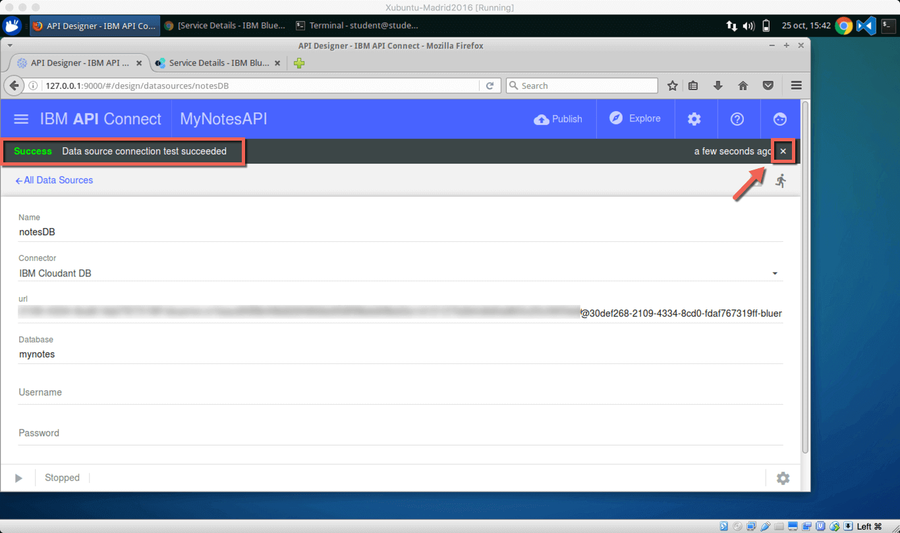
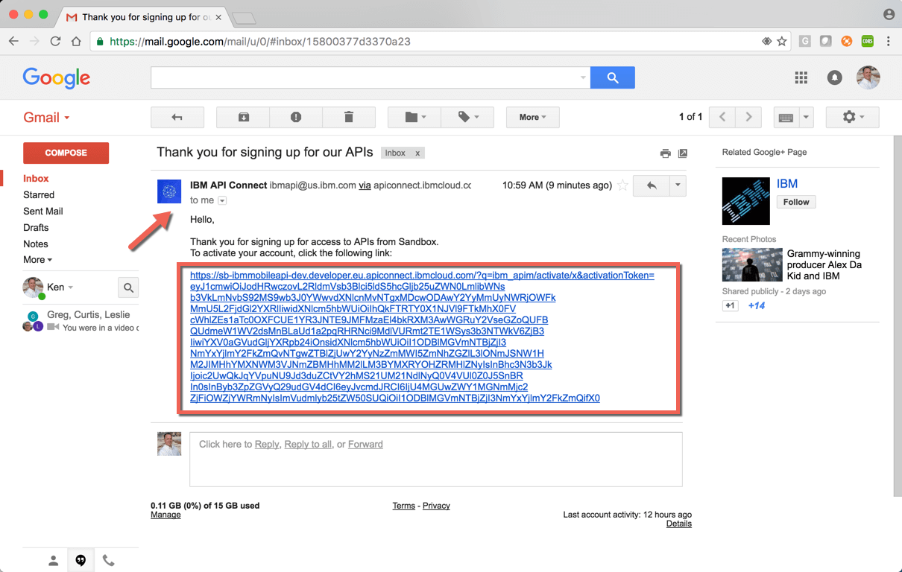
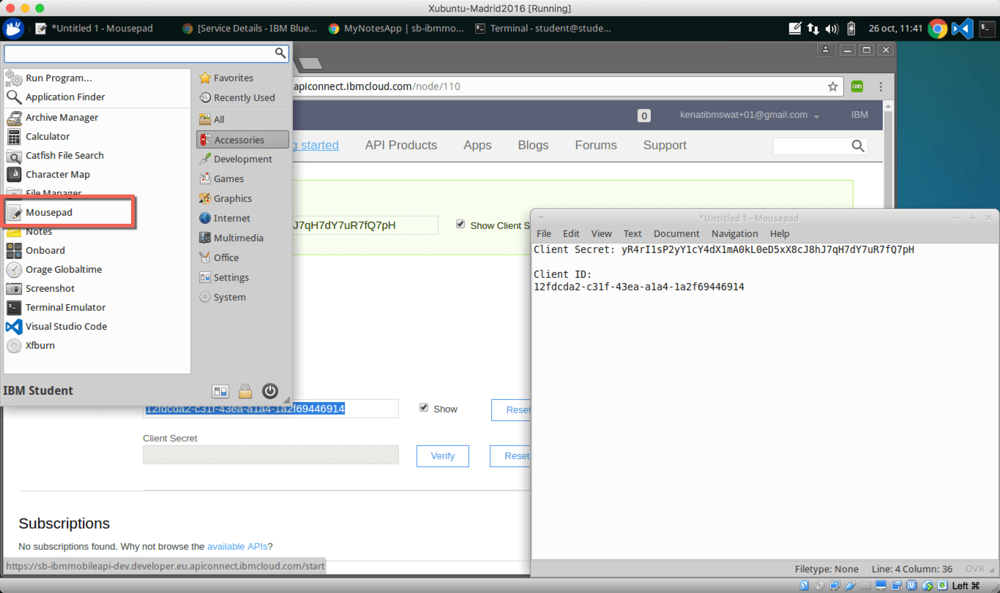
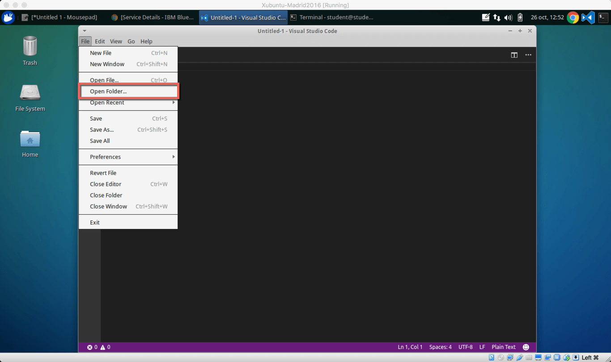
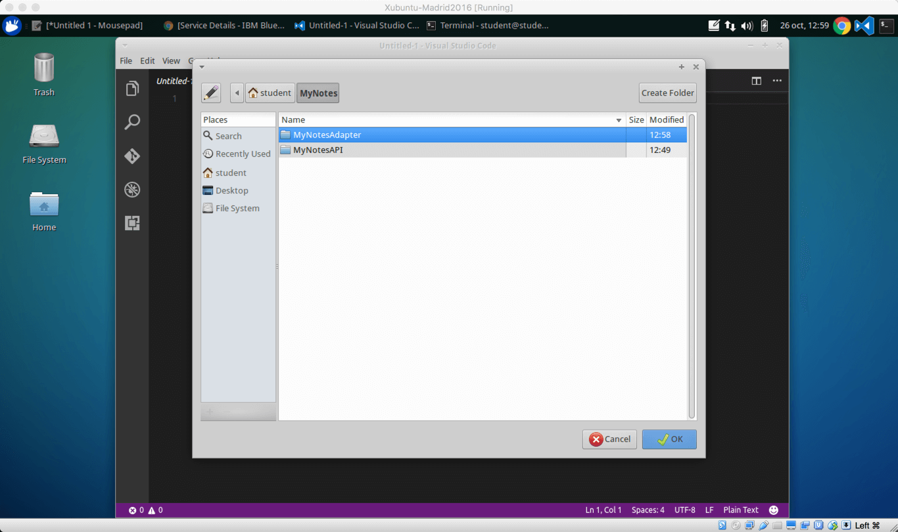

# Lab I385 - Objective 

# Lab I385 - Case Study

# Lab I385 - Requirements
The tools, and the versions, used in this lab are as follows:

+ [node version 4.5.0](https://nodejs.org/en/download/)
+ [Cordova Version 6.3.1](https://www.npmjs.com/package/cordova)
+ [Ionic Framework Command Line Interface Version 2.1.4](https://www.npmjs.com/package/ionic)
+ [MobileFirst Foundation Command Line Interface Version 8.0.0-2016101416](https://www.npmjs.com/package/mfpdev-cli)
+ [API Connect Command Line Interface Version 5.0.4.0](https://www.npmjs.com/package/apiconnect)
+ [git version 1.9.1](https://git-scm.com/downloads)
+ [gulp Version 3.9.1](https://github.com/gulpjs/gulp/blob/master/docs/getting-started.md)
+ [Visual Studio Code Version 1.5.2](https://code.visualstudio.com/download)

In addition to the above you will also need a [Bluemix Account](https://console.ng.bluemix.net) with at least 4GB of container space. Click [here](https://www.ibm.com/cloud-computing/bluemix/) for more information on [Bluemix](https://www.ibm.com/cloud-computing/bluemix/), IBM's cloud platform that helps you solve real problems and drive business value with applications, infrastructure and services.

For this lab a Bluemix instance has already been created for you. The usernames and passwords are as follows:

| **Bluemix username/password** | **Organization** | **Space** |
| ---------------- | ------------------ | -------- |
| student01@ibmmobileapi.33mail.com/CTUlab01 | IBMMobileAPI01 | CTU2016 |
| student02@ibmmobileapi.33mail.com/CTUlab02 | IBMMobileAPI02 | CTU2016 |
| student03@ibmmobileapi.33mail.com/CTUlab03 | IBMMobileAPI03 | CTU2016 |
| student04@ibmmobileapi.33mail.com/CTUlab04 | IBMMobileAPI04 | CTU2016 |
| student05@ibmmobileapi.33mail.com/CTUlab05 | IBMMobileAPI05 | CTU2016 |
| student06@ibmmobileapi.33mail.com/CTUlab06 | IBMMobileAPI06 | CTU2016 |
| student07@ibmmobileapi.33mail.com/CTUlab07 | IBMMobileAPI07 | CTU2016 |
| student08@ibmmobileapi.33mail.com/CTUlab08 | IBMMobileAPI08 | CTU2016 |
| student09@ibmmobileapi.33mail.com/CTUlab09 | IBMMobileAPI09 | CTU2016 |
| student10@ibmmobileapi.33mail.com/CTUlab10 | IBMMobileAPI10 | CTU2016 |
| student11@ibmmobileapi.33mail.com/CTUlab11 | IBMMobileAPI11 | CTU2016 |
| student12@ibmmobileapi.33mail.com/CTUlab12 | IBMMobileAPI12 | CTU2016 |

**<font color="red">PLEASE USE THE USERNAME AND PASSWORD ASSIGNED TO YOU</font>**

<!--
| User | Region | Organization | Space | Developer Portal |
| :--- | :--- | :--- | :--- | :--- |
| 1 | US South | ken.nelson@us.ibm.com | student1 | https://sb-kennelsonusibmcom-student1.developer.us.apiconnect.ibmcloud.com |
| 2 | US South | ken.nelson@us.ibm.com | student2 | https://sb-kennelsonusibmcom-student2.developer.us.apiconnect.ibmcloud.com |
| 3 | US South | ken.nelson@us.ibm.com | student3 | https://sb-kennelsonusibmcom-student3.developer.us.apiconnect.ibmcloud.com |
| 4 | US South | ken.nelson@us.ibm.com | student4 | https://sb-kennelsonusibmcom-student4.developer.us.apiconnect.ibmcloud.com |
| 5 | US South | ken.nelson@us.ibm.com | student5 | https://sb-kennelsonusibmcom-student5.developer.us.apiconnect.ibmcloud.com |
| 6 | US South | ken.nelson@us.ibm.com | student6 | https://sb-kennelsonusibmcom-student6.developer.us.apiconnect.ibmcloud.com |
| 7 | US South | ken.nelson@us.ibm.com | student7 | https://sb-kennelsonusibmcom-student7.developer.us.apiconnect.ibmcloud.com |
| 8 | US South | ken.nelson@us.ibm.com | student8 | https://sb-kennelsonusibmcom-student8.developer.us.apiconnect.ibmcloud.com |
| 9 | US South | ken.nelson@us.ibm.com | student9 | https://sb-kennelsonusibmcom-student9.developer.us.apiconnect.ibmcloud.com |
| 10 | US South | ken.nelson@us.ibm.com | student10  | https://sb-kennelsonusibmcom-student10.developer.us.apiconnect.ibmcloud.com |
| 11 | US South | ken.nelson@us.ibm.com | student11 | https://sb-kennelsonusibmcom-student11.developer.us.apiconnect.ibmcloud.com |
| 12 | US South | ken.nelson@us.ibm.com | student12 | https://sb-kennelsonusibmcom-student12.developer.us.apiconnect.ibmcloud.com |

**<font color="red">PLEASE USE THE SPACE ASSIGNED TO YOU</font>**
-->

# Information about the VM Used

The operating system used for the virtual machine is a version of [Ubuntu](https://www.ubuntu.com) called [Xubuntu](http://xubuntu.org). For more information about [Xubuntu](http://xubuntu.org), please visit [http://xubuntu.org](http://xubuntu.org).

+ **Operating System User Name:** student
+ **Operating System Password:** Passw0rd!

	> **Note:** The 0 in the password is a zero

# Lab I385 - Step by Step Lab Instructions

### Steps

1. Install the Latest Versions of the Command Line Interfaces for Ionic, MobileFirst Foundation and API Connect
1. Create Notes API using API Connect
1. Deploy API to Bluemix
1. Test API on Bluemix
1. Create MobileFirst Foundation Adapter to Consume API
1. Deploy MobileFirst Foundation Adapter to Bluemix
1. Test MobileFirst Foundation Adapter on Bluemix
1. Get and Configure Notes Application
1. Modify Notes Application to use MobileFirst Adapter
1. Deploy Notes Application to MobileFirst Foundation on Bluemix
1. Test Notes Application


## Step 1 - Install Command Line Interfaces (CLI)
The virtual machine that you are using in this lab was created a few months back and as such requires a refresh of some of the command line interfaces (CLI), specifically;

+ The Ionic Framework
+ MobileFirst Foundation CLI
+ API Connect CLI

### Refresh the Ionic Framework CLI, MobileFirst Foundation CLI, & API Connect CLI
Open a terminal session and type:

```
sudo npm install -g ionic mfpdev-cli apiconnect
```
	
After you press enter you may be asked for a password, the password needed is the operating system password for the student user. It is `Passw0rd!`.

> **Note:** The 0 in the password is a zero

You may seem some errors, but you can ignore them. What this command is doing is downloading and installing the latest versions of the Ionic Framework CLI, MobileFirst CLI, and API Connect CLI all at one time. You could install each individually by typing typing the following:

```	
sudo npm install -g ionic
sudo npm install -g mfpdev-cli
sudo npm install -g apiconnect
```

## Step 2 - Create Notes API
API Connect comes with two prebuilt api applications (collection of APIs) one is a **Hello World** application and the other is a **Notes** application. There is also an empty server application which is what you would typically use when creating an API. For this lab you will create the **Notes** application.

To create the MyNotesAPI based on the notes application, open a terminal if not already open. Ensure that you are in your user home directory `/home/student` by typing:

```
cd ~/
```

**Next**, type

```
pwd
```

The response back should be

```
/home/student
```

**Next**, create directory for your project called **MyNotes** by typing:

```
mkdir MyNotes
```

**Next**, change directory to the **MyNotes** directory by typing:

```
cd MyNotes
```

**Next**, create your API by typing:

```
apic loopback
```

You will be prompted for the following:

| Question | Answer |
| :------- | :----- |
| What's the name of your application? | **MyNotesAPI** |
| Enter the name of the directory to contain the project: | **My Notes** |
| What kind of application do you have in mind? | **notes (A project containing ...)** |


When the process completes you will be brought back to your command prompt.

**Next**, change directory to MyNotesAPI by typing following into your terminal:

```
cd MyNotesAPI
```

**Next**, Start the design environment by typing following into your terminal

```
apic edit
```

This will open a browser and request that you **Sign in with Bluemix**. Click the **Sign in with Bluemix** button.

**Next** create a datasource. With the API Connect Designer displayed **Click** the **Data Sources** link.


> **Note:** Optionally you can create a datasource for your API via the command line. To use the command line type the following into your terminal:
> 
> ```
> apic create --type datasource
> ```

When the Datasources page opens, you will notice that there is already a datasource listed. This is the in-memory database that was created by default when the application was created earlier.

**Next**, create a new datasource by **Clicking** the **Add** button. This will open a dialog name the new datasource. Name it notesDB and **Click** the **New** button.


This will open a page to enter the credentials for Cloudant. First select the the Connector type and set to **IBM Cloudant DB**. You will notice that when you do this a message will appear stating "This selected connector has not been installed", with a link to Install connector.  **Click** the **Install connector** link to install the Cloudant Loopback Connector.

The next two pieces of information are required they are the URL and the database name. First find the URL by looking at your Cloudant tile on Bluemix. To get the URL for the Cloudant database open a new browser tab and go to your Bluemix instance by typing [www.bluemix.net ](www.bluemix.net).

**Click** the **Log In** button if note alerady logged in. 


Ensure you are using the assigned Organization and Space that was assigned to you.

Scroll to the the All Services (3) section. Notice that there are three services, they are:

| Service Name | Type |
| :----------- | :--- |
| ctu2016-apic | API Connect Service |
| ctu2016-cloudant | Cloudant Service |
| ctu2016-mff | MobileFirst Foundation Service |

**Next**, **Click** the **ctu2016-cloudant** service. This will open the Bluemix Cloudant Dashboard for the ctu2016-cloudant service.  !


**Next**, with the Cloudant dashboard open, **Click** the **Service Credentials**


**Next**, locate and open the **View Credentails** dropdown listbox.


This will display the credentials for the Cloudant instance. What you are interested in is the URL. The URL attribute will have username and password as part of the URL. Highlight and copy the URL, you will past this into URL attribute for the API Connect Cloudant Datasource you are creating.


**Next**, with the URL copied, return to your API Designer Tab and past the URL into the URL field. For the **Database** field enter **mynotes**. When done, **Click** the **Save** button.


After clicking the **Save** button you will see a message that says "Testing datasource connection". When the message stating "Success Data source connection test succeeded" you will know that your datasource has been created and you can dismiss the message by **clicking** the close button (**x**). 



**Next** click the **All Data Sources** link to return to your list of datasources. 


Notice that your datasource is now in the list.


**Next** you will need to associate the new datasource with your model. The model was automatically created for you when you selected the notes application at the time you created your API. To associate the datasource with the model, **Click** the **Models** tab.


**Next** open the Note model by **Clicking** the Note link.


**Next** with the Note model open, change the **Data Source** by selecting the notesDB from the dropdown listbox.


**Finally** save the Note model by **Clicking** the **Save** button. Then **Click** the **All Models** link to return to the list of models.


## Step 3 - Deploy API to Bluemix

To save time an API Connect Bluemix service has been created for your. Hopefully you have remembered the Bluemix account that was assigned to you as you will need it in this step of the lab.

> **Note:** Typically you would test locally before you publish to API Connect on Bluemix, but since we are short on time we will go straight to testing on Bluemix. If you are would like to test locally, the process is to start the server by pressing the play button in the lower left hand corner, this will start a local version of the server. You can then click the Explore button to play around with the APIs.

First you will need to configure the target that you will be publising to. To do this **Click** the **Publish** button.


A submenu will appear. Since there are no targets you will need to add one by **Clicking** the **Add and Manage Targets** option.


And then **Click** the **Add IBM Bluemix Target** button.


In the dialog that opens, ensure that your Region is set to **United Kingdom** and that your organization is set to your username.  **Select** the Sandbox from the list of API Connect instances and then **Click** the **Next** button.


On the next screen, create a new APIC Application by typing the name of your new application in the text field at the bottom and then **Clicking** the **Add** button.


With the application added (notice that APIC converted the application name to all lower case), **Click** the **Save** button.

This action will create a new target and return you to the API Connect Designer main page.  **Click** the **Publish** button a second time. Notice that the target is now listed. **Click** the target.


**Check** the **Publish Application** and **Stage or Publish Products** checkboxes and **Click** the **Publish** button. This will initiate the application publish process.


When the publish is complete, the dialog window will close and there will be a message showing success. **Click** the **Close** message button to clear the message.


To verify that your application has published successfully, open a new tab in your browser and go to your Bluemix Console by typing [www.bluemix.net](www.bluemix.net). Login if necessary.

**Scroll** to the **All Services (3)** section and **Click** the ctu2016-apic service.


This will open the **Drafts** page of API Connect. You will not see any drafts since the application and products were published directly to APIC. If you had published a draft or created a draft API on this page, then you would see a list of products and APIs. **Click** the **Hamburger** icon to open the menu.


With the **Menu** open select the **Dashboard** menu option to open the Dashboard.


You can confirm that your application has been published if you see the mynotes application next to the Sandbox.


## Step 4 - Test API on Bluemix
To test the API, you will use the Developer Portal. The Developer Portal has already been created for you. For more information on configuring the Developer Portal, [visit here](http://www.ibm.com/support/knowledgecenter/SSFS6T/com.ibm.apic.devportal.doc/con_cmsportal_storefront.html). With your browser open to your API Connect Dashboard, **Click** the **Sandbox** item.


**Next**, **Click** the **Settings** tab.


**Next**, **Click** the **Portal** Menu Option.


This will display information about the Developer Portal configuration. Notice that the IBM Developer Portal has been selected and there is a URL that has been created. **Click** the **Portal URL** to open the Developer Portal.


**Next**, with the Developer Portal open, **Click** the **Create Account** to create a new developer account.


**Next**, Complete the registration form

> **Note:** You will need to use an email address other than the one provided for you as the adminstrator. The email address you use, you must have access to so that you can confirm the registration.


With the Registration Form complete, **Click** the **Create new account** button.


A message stating that an email confirmation has been sent is your queue that your registration has been created and is awaiting confirmation.


To confirm your registration, go to your email account and click the confirmation link.



The confirmation will take you to a login page once you yoru confirmation has been accepted.  **Click** the **Log in** button.


Once you have logged into the Developer Portal, you will need to create an App that will be used to subscribe to the API.  **Click** the **Apps** link.


**Click** the **Register new application** link.


Complete the registration form and then **Click** the **Submit** button.


Once the application is registered you will need to make note of the Client ID and the Client Secret. These will be used to authenticate your right to use the API.  **Check** the **Show Client Secret** checkbox to show the Client Secret Code, copy this code to the Mousepad application. Also **Check** the **Show** checkbox for the Client ID to show the Client ID and copy this code to the Mousepad application. (See next to learn how to open the Mousepad application).


You can find the Mousepad application under the Operating System Menu | Accessories Menu



**Next** choose an API to associate with this application by **Clicking** either the **API Products** tab at the top of the page or the **available APIs** link at the bottom of the page.


**Next**, with the list of APIs shown, **Click** the **MyNotesAPI**


**Next**, with the API page open, **Click** the **Subscribe** button.


When the dialod window opens, **Check** the **MyNotesApp** radio button and then **Click** the **Subscribe** button.


You will see that a message informing you that you have Successfully subscribed to this plan will indicate that your application is now subscribed.


**Next** you can now test out your API.  **Click** the **MyNotesAPI** link on the left.  This will open a list of API endpoints.


**Next** with the list of API endpoints show, scroll to the **GET /Notes** endpoint.


On the right hand side of the page you will see the defination of the API endpoint.  Scroll until you find the **Client Secret** textbox paste in your Client Secret to copied into Mousepad earlier. 

**Click** the **Call operation** button.


Once the operation completes, scroll a little more and you will see the **Request** that was sent and the **Response** that was returned.


> **Note:** If you get a CORS error, follow the link and accept that the error. Then re-run the operation.

## Step 5 - Create MobileFirst Foundation Adapter

In this step you will create a MobileFirst Adapater to consume the API you just created. Adapters provide mobile security, analytics, and a way to create mobile aware micro-services for your mobile applications. To create a MobileFirst adapter you will use the MobileFirst Command Line Interface.

Start by opening a terminal and navigating to your main project directory. Type the following:

```
cd ~/MyNotes
```

**Next**, create your adapter by typing the following:

```
mfpdev adapter create
```

Enter the following when prompted:

| Question | Answer |
| :--- | :--- |
| Enter adapter name: | MyNotesAdapter |
| Select adapter type: | HTTP |
| Enter group id: | com.ibm.mynotes |

This will create a new folder **MyNotesAdapter**

**Next** Open Visual Studio Code


**Next** with Visual Studio Code open, open the folder you just created (~/MyNotes/MyNotesAdapter).





HTTP Adapters have two components. The first is an xml file that describes the properties of the adapter. The second is a Javascript file that contains the code to process the adapter methods.

Open the adapter.xml file found in `src/main/adapter-resources`.

**Next** Modify the connection parameters to match the URL from API Connect. For example: `http://api.eu.apiconnect.ibmcloud.com/ibmobileapi-dev/sb/api/Notes`.

| Component | Description  |
| :--- | :--- |
| http | Protocol |
| api.eu.apiconnect.ibmcloud.com | Domain |
| ibmobileapi-dev | Bluemix Organization & Space |
| sb/api/Notes | API URL Component |

Edit the connection policy to the following:

```
	<protocol>https</protocol>
	<domain>api.us.apiconnect.ibmcloud.com</domain>
	<port>443</port>

```

Remove all the existing procedures and replace with the following:

```
	<procedure name="getNotes"/>
	<procedure name="createNote"/>
	<procedure name="updateNote"/>
	<procedure name="deleteNote"/>
```

Your adapter.xml file should look like the following:

```xml
<mfp:adapter name="MyNotesAdapter"
			 xmlns:xsi="http://www.w3.org/2001/XMLSchema-instance"
			 xmlns:mfp="http://www.ibm.com/mfp/integration"
			 xmlns:http="http://www.ibm.com/mfp/integration/http">

	<displayName>MyNotesAdapter</displayName>
	<description>MyNotesAdapter</description>
	<connectivity>
		<connectionPolicy xsi:type="http:HTTPConnectionPolicyType">
			<protocol>https</protocol>
			<domain>api.us.apiconnect.ibmcloud.com</domain>
			<port>443</port>
			<connectionTimeoutInMilliseconds>30000</connectionTimeoutInMilliseconds>
			<socketTimeoutInMilliseconds>30000</socketTimeoutInMilliseconds>
			<maxConcurrentConnectionsPerNode>50</maxConcurrentConnectionsPerNode>
		</connectionPolicy>
	</connectivity>

	<!-- Publicly available procedures -->
	<procedure name="getNotes"/>
	<procedure name="createNote"/>
	<procedure name="updateNote"/>
	<procedure name="deleteNote"/>

</mfp:adapter>
```

**Next** edit the MyNotesAdapter-impl.js. Remove all the code and add the methods to support the procedures identified in the adapter.xml

**First** add following variables. Note that you will need to replace your CLIENT ID, CLIENT SECRET, and BASE URL.

```javascript
var CLIENT_ID = '[REPLACE WITH CLIENT ID]';
var CLIENT_SECRET = '[REPLACE CLIENT SECRET]';
var ACCEPT = 'application/json';
var JSON_CONTENT_TYPE = 'application/json';
var URLENCODED_CONTENT_TYPE = 'application/x-www-form-urlencoded';
var JSON = 'json';
var POST = 'post';
var GET = 'get';
var PUT = 'put';
var DELETE = 'delete';
var BASE_URL = '[REPLACE WITH URL]';

var INPUT = {
	method : this.GET,
	returnedContentType : JSON,
	headers: {
		'Accept': ACCEPT,
		'Content-Type': JSON_CONTENT_TYPE,
		'x-ibm-client-id': CLIENT_ID,
		'x-ibm-client-secret' : CLIENT_SECRET
	}
};
```

**Next** add the code to get the list of notes:

```javascript
function getNotes() {
	INPUT.path = BASE_URL;
	INPUT.method = GET;

	return MFP.Server.invokeHttp(INPUT);
}
```

**Next** add the code to create a new note:

```javascript
function createNote(title, content){
	var note =  "title=" + title + "&content=" + content;

	var input = {
		method : PUT,
		path: BASE_URL,
		headers: {
			'Accept' : JSON_CONTENT_TYPE,
			'x-ibm-client-id': CLIENT_ID,
			'x-ibm-client-secret' : CLIENT_SECRET},
		body: {
			content: note,
			contentType: URLENCODED_CONTENT_TYPE
		}
	};

	return MFP.Server.invokeHttp(input);
}
```

**Next** add the code to update an existing note:

```javascript
function updateNote(id, title, content){
	var note =  "title=" + title + "&content=" + content;
	var where = encodeURIComponent('{"_id": "' + id + '"}')

	var input = {
		method : POST,
		path: BASE_URL + '/update?where=' + where,
		headers: {
			'Accept' : JSON_CONTENT_TYPE,
			'x-ibm-client-id': CLIENT_ID,
			'x-ibm-client-secret' : CLIENT_SECRET},
		body: {
			content: note,
			contentType: URLENCODED_CONTENT_TYPE
		}
	};

	return MFP.Server.invokeHttp(input);
}
```

**Finally** add the code to delete an existing note:

```javascript
function deleteNote(id){
	var input = {
		method : DELETE,
		path: BASE_URL + '/' + id,
		headers: {
			'Accept' : JSON_CONTENT_TYPE,
			'x-ibm-client-id': CLIENT_ID,
			'x-ibm-client-secret' : CLIENT_SECRET
		}
	};

	return MFP.Server.invokeHttp(input);
}
```


