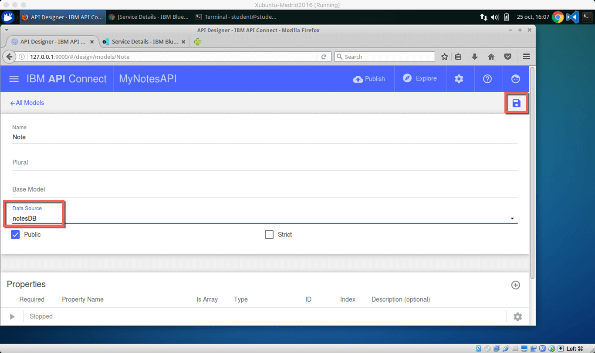

# Lab I385 - Objective 

# Lab I385 - Case Study

# Lab I385 - Requirements
The tools, and the versions, used in this lab are as follows:

+ [node version 4.5.0](https://nodejs.org/en/download/)
+ [Cordova Version 6.3.1](https://www.npmjs.com/package/cordova)
+ [Ionic Framework Command Line Interface Version 2.1.4](https://www.npmjs.com/package/ionic)
+ [MobileFirst Foundation Command Line Interface Version 8.0.0-2016101416](https://www.npmjs.com/package/mfpdev-cli)
+ [API Connect Command Line Interface Version 5.0.4.0](https://www.npmjs.com/package/apiconnect)
+ [git version 1.9.1](https://git-scm.com/downloads)
+ [gulp Version 3.9.1](https://github.com/gulpjs/gulp/blob/master/docs/getting-started.md)
+ [Visual Studio Code Version 1.5.2](https://code.visualstudio.com/download)

In addition to the above you will also need a [Bluemix Account](https://console.ng.bluemix.net). Click [here](https://www.ibm.com/cloud-computing/bluemix/) for more information on [Bluemix](https://www.ibm.com/cloud-computing/bluemix/), IBM's cloud platform that helps you solve real problems and drive business value with applications, infrastructure and services.

For this lab a Bluemix instance has already been created for you. The usernames and passwords are as follows:

| **Bluemix username/password** | **Organization** | **Space** |
| ---------------- | ------------------ | -------- |
| ibmmobileapi+01@gmail.com/CTUlab01 | IBMMobileAPI01 | CTU2016 |
| ibmmobileapi+02@gmail.com/CTUlab02 | IBMMobileAPI02 | CTU2016 |
| ibmmobileapi+03@gmail.com/CTUlab03 | IBMMobileAPI03 | CTU2016 |
| ibmmobileapi+04@gmail.com/CTUlab04 | IBMMobileAPI04 | CTU2016 |
| ibmmobileapi+05@gmail.com/CTUlab05 | IBMMobileAPI05 | CTU2016 |
| ibmmobileapi+06@gmail.com/CTUlab06 | IBMMobileAPI06 | CTU2016 |
| ibmmobileapi+07@gmail.com/CTUlab07 | IBMMobileAPI07 | CTU2016 |
| ibmmobileapi+08@gmail.com/CTUlab08 | IBMMobileAPI08 | CTU2016 |
| ibmmobileapi+09@gmail.com/CTUlab09 | IBMMobileAPI09 | CTU2016 |
| ibmmobileapi+10@gmail.com/CTUlab10 | IBMMobileAPI10 | CTU2016 |
| ibmmobileapi+11@gmail.com/CTUlab11 | IBMMobileAPI11 | CTU2016 |
| ibmmobileapi+12@gmail.com/CTUlab12 | IBMMobileAPI12 | CTU2016 |

**<font color="red">PLEASE USE THE USERNAME AND PASSWORD ASSIGNED TO YOU</font>**

# Information about the VM Used

The operating system used for the virtual machine is a version of [Ubuntu](https://www.ubuntu.com) called [Xubuntu](http://xubuntu.org). For more information about [Xubuntu](http://xubuntu.org), please visit [http://xubuntu.org](http://xubuntu.org).

+ **Operating System User Name:** student
+ **Operating System Password:** Passw0rd!

	> **Note:** The 0 in the password is a zero

# Lab I385 - Step by Step Lab Instructions

### Steps

1. Install the Latest Versions of the Command Line Interfaces for Ionic, MobileFirst Foundation and API Connect
1. Create Notes API using API Connect
1. Deploy API to Bluemix
1. Test API on Bluemix
1. Create MobileFirst Foundation Adapter to Consume API
1. Deploy MobileFirst Foundation Adapter to Bluemix
1. Test MobileFirst Foundation Adapter on Bluemix
1. Get and Configure Notes Application
1. Modify Notes Application to use MobileFirst Adapter
1. Deploy Notes Application to MobileFirst Foundation on Bluemix
1. Test Notes Application


## Step 1 - Install Command Line Interfaces (CLI)
The virtual machine that you are using in this lab was created a few months back and as such requires a refresh of some of the command line interfaces (CLI), specifically;

+ The Ionic Framework
+ MobileFirst Foundation CLI
+ API Connect CLI

### Refresh the Ionic Framework CLI, MobileFirst Foundation CLI, & API Connect CLI
Open a terminal session and type:

```
sudo npm install -g ionic mfpdev-cli apiconnect
```
	
After you press enter you may be asked for a password, the password needed is the operating system password for the student user. It is `Passw0rd!`.

> **Note:** The 0 in the password is a zero

You may seem some errors, but you can ignore them. What this command is doing is downloading and installing the latest versions of the Ionic Framework CLI, MobileFirst CLI, and API Connect CLI all at one time. You could install each individually by typing typing the following:

```	
sudo npm install -g ionic
sudo npm install -g mfpdev-cli
sudo npm install -g apiconnect
```

## Step 2 - Create Notes API
API Connect comes with two prebuilt api applications (collection of APIs) one is a **Hello World** application and the other is a **Notes** application. There is also an empty server application which is what you would typically use when creating an API. For this lab you will create the **Notes** application.

To create the MyNotesAPI based on the notes application, open a terminal if not already open. Ensure that you are in your user home directory `/home/student` by typing:

```
cd ~/
```

**Next**, type

```
pwd
```

The response back should be

```
/home/student
```

**Next**, create directory for your project called **MyNotes** by typing:

```
mkdir MyNotes
```

**Next**, change directory to the **MyNotes** directory by typing:

```
cd MyNotes
```

**Next**, create your API by typing:

```
apic loopback
```

You will be prompted for the following:

| Question | Answer |
| :------- | :----- |
| What's the name of your application? | **MyNotesAPI** |
| Enter the name of the directory to contain the project: | **My Notes** |
| What kind of application do you have in mind? | **notes (A project containing ...)** |


When the process completes you will be brought back to your command prompt.

**Next**, change directory to MyNotesAPI by typing following into your terminal:

```
cd MyNotesAPI
```

**Next**, Start the design environment by typing following into your terminal

```
apic edit
```

This will open a browser and request that you **Sign in with Bluemix**. Click the **Sign in with Bluemix** button.

**Next** create a datasource. With the API Connect Designer displayed **Click** the **Data Sources** link.


> **Note:** Optionally you can create a datasource for your API via the command line. To use the command line type the following into your terminal:
> 
> ```
> apic create --type datasource
> ```

When the Datasources page opens, you will notice that there is already a datasource listed. This is the in-memory database that was created by default when the application was created earlier.

**Next**, create a new datasource by **Clicking** the **Add** button. This will open a dialog name the new datasource. Name it notesDB and **Click** the **New** button.


This will open a page to enter the credentials for Cloudant. First select the the Connector type and set to **IBM Cloudant DB**. You will notice that when you do this a message will appear stating "This selected connector has not been installed", with a link to Install connector.  **Click** the **Install connector** link to install the Cloudant Loopback Connector.

The next two pieces of information are required they are the URL and the database name. First find the URL by looking at your Cloudant tile on Bluemix. To get the URL for the Cloudant database open a new browser tab and go to your Bluemix instance by typing [www.bluemix.net ](www.bluemix.net).

**Click** the **Log In** button if note alerady logged in.


Scroll to the the All Services (3) section. Notice that there are three services, they are:

| Service Name | Type |
| :----------- | :--- |
| ctu2016-apic | API Connect Service |
| ctu2016-cloudant | Cloudant Service |
| ctu2016-mff | MobileFirst Foundation Service |

**Next**, **Click** the **ctu2016-cloudant** service. This will open the Bluemix Cloudant Dashboard for the ctu2016-cloudant service.  !


**Next**, with the Cloudant dashboard open, **Click** the **Service Credentials**


**Next**, locate and open the **View Credentails** dropdown listbox.


This will display the credentials for the Cloudant instance. What you are interested in is the URL. The URL attribute will have username and password as part of the URL. Highlight and copy the URL, you will past this into URL attribute for the API Connect Cloudant Datasource you are creating.


**Next**, with the URL copied, return to your API Designer Tab and past the URL into the URL field. For the **Database** field enter **mynotes**. When done, **Click** the **Save** button.


After clicking the **Save** button you will see a message that says "Testing datasource connection". When the message stating "Success Data source connection test succeeded" you will know that your datasource has been created and you can dismiss the message by **clicking** the close button (**x**). 


**Next** click the **All Data Sources** link to return to your list of datasources. 


Notice that your datasource is now in the list.


**Next** you will need to associate the new datasource with your model. The model was automatically created for you when you selected the notes application at the time you created your API. To associate the datasource with the model, **Click** the **Models** tab.


**Next** open the Note model by **Clicking** the Note link.


**Next** with the Note model open, change the **Data Source** by selecting the notesDB from the dropdown listbox.



**Finally** save the Note model by **Clicking** the **Save** button. Then **Click** the **All Models** link to return to the list of models.


## Step 3 - Deploy API to Bluemix

To save time an API Connect Bluemix service has been created for your. Hopefully you have remembered the Bluemix account that was assigned to you as you will need it in this step of the lab.

> **Note:** Typically you would test locally before you publish to API Connect on Bluemix, but since we are short on time we will go straight to testing on Bluemix. If you are would like to test locally, the process is to start the server by pressing the play button in the lower left hand corner, this will start a local version of the server. You can then click the Explore button to play around with the APIs.

First you will need to configure the target that you will be publising to. To do this **Click** the **Publish** button.


A submenu will appear. Since there are no targets you will need to add one by **Clicking** the **Add and Manage Targets** option.


And then **Click** the **Add IBM Bluemix Target** button.


In the dialog that opens, ensure that your Region is set to **United Kingdom** and that your organization is set to your username.  **Select** the Sandbox from the list of API Connect instances and then **Click** the **Next** button.


On the next screen, create a new APIC Application by typing the name of your new application in the text field at the bottom and then **Clicking** the **Add** button.


With the application added (notice that APIC converted the application name to all lower case), **Click** the **Save** button.

This action will create a new target and return you to the API Connect Designer main page.  **Click** the **Publish** button a second time. Notice that the target is now listed. **Click** the target.


**Check** the **Publish Application** and **Stage or Publish Products** checkboxes and **Click** the **Publish** button. This will initiate the application publish process.


When the publish is complete, the dialog window will close and there will be a message showing success. **Click** the **Close** message button to clear the message.


To verify that your application has published successfully, open a new tab in your browser and go to your Bluemix Console by typing [www.bluemix.net](www.bluemix.net). Login if necessary.

**Scroll** to the **All Services (3)** section and **Click** the ctu2016-apic service.


This will open the **Drafts** page of API Connect. You will not see any drafts since the application and products were published directly to APIC. If you had published a draft or created a draft API on this page, then you would see a list of products and APIs. **Click** the **Hamburger** icon to open the menu.


With the **Menu** open select the **Dashboard** menu option to open the Dashboard.


You can confirm that your application has been published if you see the mynotes application next to the Sandbox.


## Step 4 - Test API on Bluemix


